# Animated-SVG-in-Git feasibility spike

**Figure 2.1.1 (CCNA2 · switching concepts), rebuilt from its declarative `spec.json`
as a self-contained animated SVG (SMIL). If GitHub renders it, the animation below plays —
no JS, no external resources.**

## Animated SVG (72 KB)

## Reference: the same animation as APNG (1.1 MB)

---
*Spike artifact for nsalab-tmn/learn-knowledge-base#219 (Figma→Git asset pipeline, D2).*
