# Animated-SVG-in-Git feasibility spike

**Figure 2.1.1 (CCNA2 · switching concepts), rebuilt from its declarative `spec.json`
as a self-contained animated SVG (SMIL). If GitHub renders it, the animation below plays —
no JS, no external resources.**

## Animated SVG (72 KB)

## Reference: the same animation as APNG (1.1 MB)

## isoTilt stress test: figure 13.2.4 (192 KB vs 5.7 MB APNG)

The signature envelope choreography: one continuous envelope rides iso links and
**turns in place** (up -> flat -> down morphs on the router and the right switch),
plus PC blue-screen overlays. The envelope and its tilts are pure vector
(builder-identical R(theta)*S*R(45) chain in SMIL); verified vs the Figma Motion
render at <=1 px centroid/bbox deviation on all checkpoints.

---
*Spike artifact for nsalab-tmn/learn-knowledge-base#219 (Figma→Git asset pipeline, D2).*
